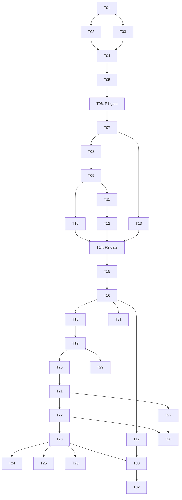

# Gurow ticket breakdown

Status: breakdown approved. All 32 tickets are published with `ready-for-agent`; 36 native GitHub blocking relationships are verified.

Parent: [Gurow MVP spec #1](https://github.com/harkon666/Gurow/issues/1). Publication verification confirmed that the parent issue was unchanged.

T01–T32 are stable local ticket identifiers. The table maps them to actual GitHub issue numbers. Each local ticket body matches its published issue and uses real issue references in its Blocked by section. GitHub also records each blocker as a native dependency between the implementation issues.

## Slice boundaries

- P1 (T01–T06) proves browser → Rust editor/rendering → React learning panel → local restoration, with real WebGPU and measured recovery/performance acceptance.
- P2 (T07–T14) proves backend request → domain behavior → PostgreSQL → readable response using controlled actor/content fixtures. The parent explicitly excludes a full production UI and authentication-provider integration from this proof.
- MVP (T15–T32) connects product user flows through UI, authorized backend operations, persistence, and behavior tests. Each ticket includes the tests for its own outcome.
- T06 must pass before any P2 work starts; T14 must pass before the remaining MVP slices start. These are accepted delivery gates, even though some technical modules could otherwise be developed independently.
- The repository is still a starter; no standalone prefactoring ticket is needed. T01 makes the editor boundary usable through its first visible feature, and T07 introduces persistence through actual Enrollment behavior.
- A ticket is ready to start only when every direct blocker is complete. Transitive prerequisites are omitted from the direct-edge lists.

## Published tickets

| Ticket source | GitHub issue | Stage | Title | Blocked by | What it delivers |
| --- | --- | --- | --- | --- | --- |
| [T01](01-select-skills-in-webgpu.md) | [#2](https://github.com/harkon666/Gurow/issues/2) | P1 | Create and select Skill cards in the Rust/WebGPU editor | None | Buat dan pilih kartu Skill pada WebGPU nyata; pilihan tampil di panel React. |
| [T02](02-navigate-drag-and-undo.md) | [#3](https://github.com/harkon666/Gurow/issues/3) | P1 | Pan, zoom, drag, and undo Skill placement | T01 | Pan, zoom di posisi pointer, dan drag kartu dengan satu langkah undo per drag. |
| [T03](03-connect-prerequisite-dag.md) | [#4](https://github.com/harkon666/Gurow/issues/4) | P1 | Connect Skills while preserving a valid Prerequisite Graph | T01 | Buat koneksi Prerequisite dan tolak siklus tanpa merusak graph yang valid. |
| [T04](04-edit-task-and-restore-path.md) | [#5](https://github.com/harkon666/Gurow/issues/5) | P1 | Edit a Skill Task and restore the complete local learning scene | T02, T03 | Edit Task di sidebar; reload memulihkan ID, posisi, koneksi, dan isi Task. |
| [T05](05-recover-renderer-and-use-list.md) | [#6](https://github.com/harkon666/Gurow/issues/6) | P1 | Keep Skill and Task navigation usable through renderer failure | T04 | Navigasi keyboard tetap tersedia saat GPU gagal; dokumen dipertahankan dan renderer bisa dicoba ulang. |
| [T06](06-meet-p1-responsiveness-gate.md) | [#7](https://github.com/harkon666/Gurow/issues/7) | P1 | Meet the P1 responsiveness and recovery acceptance gate | T05 | Buktikan seluruh P1 dan target p95 frame 20 ms serta respons input 50 ms. |
| [T07](07-enroll-through-postgres.md) | [#8](https://github.com/harkon666/Gurow/issues/8) | P2 | Accept an Enrollment Invitation and read scoped participation | T06 | API dengan PostgreSQL menerima undangan fixture dan menghasilkan satu Enrollment yang terlindungi. |
| [T08](08-submit-private-draft-revisions.md) | [#9](https://github.com/harkon666/Gurow/issues/9) | P2 | Send private Task drafts as immutable Submission Revisions | T07 | Draft privat dikirim menjadi revisi immutable dalam satu Submission per Task dan Enrollment. |
| [T09](09-review-and-derive-progress.md) | [#10](https://github.com/harkon666/Gurow/issues/10) | P2 | Review a Submission Revision and derive XP, Mastery, and Access | T08 | Approval atau Changes Requested menghasilkan progres yang benar dan menolak Review revisi usang. |
| [T10](10-revoke-approval-and-correct-progress.md) | [#11](https://github.com/harkon666/Gurow/issues/11) | P2 | Revoke Approval and retain coherent learning history | T09 | Pencabutan Approval mengoreksi XP dan Mastery tanpa menghapus riwayat atau Mastery lain yang valid. |
| [T11](11-grant-scoped-access-override.md) | [#12](https://github.com/harkon666/Gurow/issues/12) | P2 | Grant and revoke an audited Access Override | T09 | Coach membuka satu Skill untuk satu Enrollment dengan alasan dan audit, tanpa mengubah XP atau Mastery. |
| [T12](12-deactivate-and-reactivate-enrollment.md) | [#13](https://github.com/harkon666/Gurow/issues/13) | P2 | Stop and resume Enrollment while retaining eligible Reviews | T11 | Deaktivasi menghentikan pekerjaan baru; Review lama tetap sah dan reaktivasi hanya oleh Coach. |
| [T13](13-correct-personal-rewards.md) | [#14](https://github.com/harkon666/Gurow/issues/14) | P2 | Correct personal Task rewards without rewriting Mastery | T07 | Uji completion, perubahan reward 20→50, koreksi XP, dan kebebasan Mastery personal. |
| [T14](14-meet-p2-concurrency-gate.md) | [#15](https://github.com/harkon666/Gurow/issues/15) | P2 | Preserve progress under competing learning requests and pass P2 | T10, T12, T13 | Buktikan retry dan request bersamaan tidak menggandakan reward atau merusak progres; tutup gate P2. |
| [T15](15-sign-in-to-private-workspace.md) | [#16](https://github.com/harkon666/Gurow/issues/16) | MVP | Sign in and enter an owner-only Personal Workspace | T14 | Login dengan identitas tepercaya membuka satu Personal Workspace privat per Account. |
| [T16](16-author-personal-learning-path.md) | [#17](https://github.com/harkon666/Gurow/issues/17) | MVP | Create and reopen a personal Learning Path with Skills and Tasks | T15 | Buat Path personal berisi Skill, Task, dan Prerequisite lalu simpan dan buka kembali dari backend. |
| [T17](17-track-personal-learning.md) | [#18](https://github.com/harkon666/Gurow/issues/18) | MVP | Track personal completion, Mastery, rewards, and Access | T16 | UI personal menyediakan completion, reward, Mastery bebas, lock reason, dan override eksplisit. |
| [T18](18-author-coach-learning-path-draft.md) | [#19](https://github.com/harkon666/Gurow/issues/19) | MVP | Own a Coach Workspace and author a Learning Path Draft | T16 | Coach membuat Workspace dan Draft dengan outcome, Required/Enrichment Task, Optional Skill, serta aturan progres. |
| [T19](19-publish-valid-learning-path-version.md) | [#20](https://github.com/harkon666/Gurow/issues/20) | MVP | Publish a completable Version and preserve its learning contract | T18 | Validasi rute wajib saat publish; perubahan konten membuat Version baru dengan ID logis yang tetap. |
| [T20](20-invite-and-admit-learners.md) | [#21](https://github.com/harkon666/Gurow/issues/21) | MVP | Invite verified learners and control new Enrollments | T19 | Kirim dan terima undangan Version tertentu; Coach dapat membuka atau menutup Enrollment baru. |
| [T21](21-navigate-enrolled-learning-path.md) | [#22](https://github.com/harkon666/Gurow/issues/22) | MVP | Navigate an enrolled Version and inspect learning requirements | T20 | Learner membuka Version yang diikuti melalui canvas/list dan melihat Task, progres, serta alasan terkunci. |
| [T22](22-submit-work-from-learning-ui.md) | [#23](https://github.com/harkon666/Gurow/issues/23) | MVP | Prepare private work and send Task revisions from the learning UI | T21 | Learner menyiapkan draft privat, mengirim teks/URL, dan membaca riwayat revisi dari UI. |
| [T23](23-review-work-from-coach-ui.md) | [#24](https://github.com/harkon666/Gurow/issues/24) | MVP | Review learner work and show the resulting progress | T22 | Coach memberi Approval/Changes Requested; learner melihat feedback, XP, Mastery, dan Access terbaru. |
| [T24](24-correct-review-from-coach-ui.md) | [#25](https://github.com/harkon666/Gurow/issues/25) | MVP | Correct an Approval and explain resulting learning changes | T23 | UI pencabutan Approval menampilkan alasan, koreksi progres, dan riwayat yang tetap tersimpan. |
| [T25](25-manage-coach-access-overrides.md) | [#26](https://github.com/harkon666/Gurow/issues/26) | MVP | Manage an individual learner's Access Overrides | T23 | Coach memberikan atau mencabut override dari UI; learner melihat pengecualian dan alasan Access. |
| [T26](26-manage-enrollment-participation.md) | [#27](https://github.com/harkon666/Gurow/issues/27) | MVP | Stop and resume participation from learner and Coach views | T23 | Learner/Coach melakukan deaktivasi; Coach mereaktivasi Enrollment yang sama sambil mempertahankan histori. |
| [T27](27-share-coach-layout-updates.md) | [#28](https://github.com/harkon666/Gurow/issues/28) | MVP | Update shared Canvas Layout without changing learning content | T21 | Coach merapikan posisi kartu pada Version terbit; learner mendapat layout terbaru dengan kamera masing-masing. |
| [T28](28-recover-stale-and-unsaved-work.md) | [#29](https://github.com/harkon666/Gurow/issues/29) | MVP | Recover stale editor saves and private unsent work | T22, T27 | Konflik dua tab mempertahankan perubahan lokal; pemulihan draft dan editor aman antar-Account. |
| [T29](29-copy-independent-learning-content.md) | [#30](https://github.com/harkon666/Gurow/issues/30) | MVP | Reuse Skills and Tasks as independent learning definitions | T19 | Salin Skill beserta Task atau salin Task saja dengan ID baru dan tanpa membawa progres. |
| [T30](30-archive-content-with-history.md) | [#31](https://github.com/harkon666/Gurow/issues/31) | MVP | Archive learning content while keeping evidence and progress readable | T17, T23 | Konten berhistori diarsipkan; Submission, Review, XP, Mastery, dan privasinya tetap dipertahankan. |
| [T31](31-arrange-selected-skills.md) | [#32](https://github.com/harkon666/Gurow/issues/32) | MVP | Arrange several selected Skills in one editor operation | T16 | Box multiselection dan drag beberapa Skill tersimpan sebagai satu operasi yang bisa di-undo. |
| [T32](32-delete-unused-editor-content.md) | [#33](https://github.com/harkon666/Gurow/issues/33) | MVP | Delete unused Skills and connections without erasing learning history | T30 | Hapus konten yang belum berhistori dan koneksi editable dengan aman; undo tetap tunduk pada validasi domain. |

## Dependency overview

T06 / #7 has a prepared [benchmark contract and L3 execution breakdown](t06-l3/README.md). These seven approved packets are published as native sub-issues #34–#40 with verified blockers and `ready-for-agent`; they do not replace the original T06 criteria or establish P1 acceptance.

### Published T06 executable sub-issues

| Ticket source | GitHub issue | Stage | Title | Blocked by | What it delivers |
| --- | --- | --- | --- | --- | --- |
| [T06-L3-01](t06-l3/qualify-presentation-collector.md) | [#34](https://github.com/harkon666/Gurow/issues/34) | P1 | Qualify input-to-presentation evidence on the reference browser | A | **Closed: explicit `UNSUPPORTED` collector result; L3-03 blocked by [#41](https://github.com/harkon666/Gurow/issues/41)** |
| [T06-L3-02](t06-l3/load-deterministic-workloads.md) | [#35](https://github.com/harkon666/Gurow/issues/35) | P1 | Load deterministic benchmark workloads through the existing application | A | Prescribed fixtures load through normal app with correct IDs, Tasks, DAG and visible labels |
| [T06-L3-03](t06-l3/capture-primary-interactions.md) | [#37](https://github.com/harkon666/Gurow/issues/37) | P1 | Capture the primary pan, zoom and drag workload with qualified timing | L3-01, L3-02, L3-04 | Nine primary windows produce complete input/presentation evidence |
| [T06-L3-04](t06-l3/reduce-and-validate-reports.md) | [#36](https://github.com/harkon666/Gurow/issues/36) | P1 | Turn raw benchmark evidence into reproducible verdicts and reports | A | Evidence reduces to validated JSON/Markdown verdicts; malformed evidence cannot pass |
| [T06-L3-05](t06-l3/record-comparisons-and-diagnostics.md) | [#38](https://github.com/harkon666/Gurow/issues/38) | P1 | Record comparison workloads and explain benchmark resource costs | L3-03, L3-04 | Comparison workloads and resource/boundary diagnostics feed the report |
| [T06-L3-06](t06-l3/integrate-functional-and-gate-checks.md) | [#39](https://github.com/harkon666/Gurow/issues/39) | P1 | Complete P1 flow plus T06 acceptance runs from current-source harness | L3-05 | Complete P1 flow plus T06 acceptance runs from current-source harness |
| [T06-L3-07](t06-l3/review-evidence-and-decide-p1.md) | [#40](https://github.com/harkon666/Gurow/issues/40) | P1 | Independent review and justified parent-gate decision/follow-up | L3-06 | Independent review and justified parent-gate decision/follow-up |

## Spec coverage

All 85 numbered User Stories are mapped below. Shared stories appear in the prototype proof and the later product integration where both need acceptance evidence. The prototype ticket does not claim the complete product story is already delivered.

| User Story | Tickets covering the behavior |
| --- | --- |
| US01 | T15, T18 |
| US02 | T15, T16 |
| US03 | T15 |
| US04 | T18 |
| US05 | T15, T18, T21 |
| US06 | T16, T18 |
| US07 | T18, T29 |
| US08 | T04, T16, T18 |
| US09 | T29 |
| US10 | T29 |
| US11 | T03, T16 |
| US12 | T03, T16 |
| US13 | T09, T17, T21 |
| US14 | T17, T21 |
| US15 | T09, T17, T21, T23 |
| US16 | T13, T17 |
| US17 | T13, T17 |
| US18 | T13, T17 |
| US19 | T13, T17 |
| US20 | T13, T17 |
| US21 | T13, T17 |
| US22 | T13, T17 |
| US23 | T13, T17 |
| US24 | T13, T17 |
| US25 | T13, T17 |
| US26 | T09, T17, T23 |
| US27 | T10, T13, T17, T24 |
| US28 | T18 |
| US29 | T19 |
| US30 | T19 |
| US31 | T09, T19, T23 |
| US32 | T09, T23 |
| US33 | T19 |
| US34 | T19 |
| US35 | T19, T21 |
| US36 | T19, T29 |
| US37 | T07, T20 |
| US38 | T07, T20 |
| US39 | T07, T14, T20 |
| US40 | T20 |
| US41 | T07, T21, T23, T30 |
| US42 | T08, T22, T30 |
| US43 | T08, T22 |
| US44 | T08, T14, T22 |
| US45 | T08, T14, T22 |
| US46 | T09, T23 |
| US47 | T08, T22 |
| US48 | T08, T22, T29 |
| US49 | T09, T22, T23 |
| US50 | T09, T22, T23 |
| US51 | T10, T24 |
| US52 | T10, T24 |
| US53 | T10, T24 |
| US54 | T09, T14, T23 |
| US55 | T10, T14, T24 |
| US56 | T09, T21, T23 |
| US57 | T11, T25 |
| US58 | T11, T25 |
| US59 | T09, T10, T11, T23, T24, T25 |
| US60 | T12, T26 |
| US61 | T12, T26 |
| US62 | T12, T26 |
| US63 | T12, T26 |
| US64 | T12, T20, T25, T26 |
| US65 | T07, T14, T15, T18, T20 |
| US66 | T30, T32 |
| US67 | T13, T30, T32 |
| US68 | T01, T16, T21 |
| US69 | T31 |
| US70 | T02 |
| US71 | T03, T32 |
| US72 | T02, T31, T32 |
| US73 | T01, T04, T16 |
| US74 | T27 |
| US75 | T21, T27 |
| US76 | T04, T21, T27 |
| US77 | T16, T27, T28, T31, T32 |
| US78 | T04, T05, T22, T28 |
| US79 | T17, T22, T23, T28 |
| US80 | T01, T02, T06, T31 |
| US81 | T05, T21, T22, T23 |
| US82 | T05, T06 |
| US83 | T04, T06, T16, T28 |
| US84 | T06 |
| US85 | T14, T28 |

## Review and publication

The user approved the complete breakdown before publication. All 32 published bodies and labels were read back and verified; all 36 native blocking relationships match the approved graph. The parent issue was neither edited nor closed.

Initial available work: [T01 / #2](https://github.com/harkon666/Gurow/issues/2). P1 gate: [T06 / #7](https://github.com/harkon666/Gurow/issues/7). P2 gate: [T14 / #15](https://github.com/harkon666/Gurow/issues/15). The `ready-for-agent` label describes specified work; native blockers determine which ticket can start. Publication completes planning, not any implementation or prototype acceptance.

Known follow-ups retain their status from the parent: concrete authentication/email integration must be recorded during its product slices; invitation expiry, archive restoration, broader Account/Workspace lifecycle policies, and time-based Mastery expiry are not silently added to these tickets. P1 and P2 must report actual evidence rather than treat a closed implementation task as proof of an unmeasured gate.
