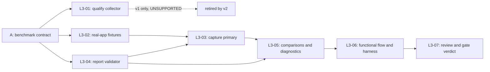

# T06 / #7 — executable L3 breakdown

Status: **Nine approved execution packets published as sub-issues #34–#40, #42 and #43. L3-01 (#34) closed `UNSUPPORTED` (v1 only); L3-02 (#35) and L3-04 (#36) delivered; L3-03 (#37) delivered the first complete `gurow-p1-v4` capture on 2026-09-30, and the P1 gate measured **FAIL** on every primary scenario (pooled frame p95 48.6 / 84.9 / 121.2 ms for pan / zoom / drag against 20 ms; drag latency proxy p95 167 ms against 50 ms; pan/zoom wheel backpressure). L3-08 (#42) profiles and fixes that bottleneck; L3-09 (#43) makes a silently non-rendering WebGPU canvas report failure. L3-09 (#43) is delivered. On 2026-10-02, [ADR 0020](../../adr/0020-right-size-the-p1-gate-for-the-mvp.md) right-sized the gate: L3-05 (#38) and L3-07 (#40) are closed as not planned, and L3-06 (#39) and L3-08 (#42) were slimmed and republished.** Parent [#7](https://github.com/harkon666/Gurow/issues/7) remains the P1 gate and is not passed.

**Revised 2026-09-30 to contract `gurow-p1-v4`** ([ADR 0019](../../adr/0019-measure-p1-responsiveness-with-frame-time-and-an-in-app-latency-proxy.md)). The v1 presentation-collector/optical requirement could not be acquired on the reference host ([qualification status](../../benchmarks/p1/qualification-status.md)); v2 measures frame time and an in-app input-to-frame proxy instead. [#41](https://github.com/harkon666/Gurow/issues/41) is closed as not planned and no longer blocks L3-03; L3-01's `UNSUPPORTED` verdict remains a historical v1 record.

Start with [benchmark contract](../../benchmarks/p1/contract.md), [numeric protocol v4](../../benchmarks/p1/protocol-v4.json), and [observed reference host](../../benchmarks/p1/reference-environment.json). The contract is fixed enough to implement. A finished design is not evidence of a passing gate.

## Tasks and dependencies

| ID | Independently verifiable outcome | Blocked by | Executor | User stories |
| --- | --- | --- | --- | --- |
| [L3-01](qualify-presentation-collector.md) / [#34](https://github.com/harkon666/Gurow/issues/34) — **CLOSED, `UNSUPPORTED` (v1 only; not required under v2)** | Real-app collector qualification, or explicit unsupported result | A | Strong / measurement specialist | US80, US84 |
| [L3-02](load-deterministic-workloads.md) / [#35](https://github.com/harkon666/Gurow/issues/35) | Prescribed fixtures load through normal app with correct IDs, Tasks, DAG and visible labels | A | Flash candidate | US80, US83, US84 |
| [L3-03](capture-primary-interactions.md) / [#37](https://github.com/harkon666/Gurow/issues/37) | Nine primary windows produce in-app frame and latency-proxy evidence and a v2 report | L3-02, L3-04 | Flash with independent review | US80, US84 |
| [L3-04](reduce-and-validate-reports.md) / [#36](https://github.com/harkon666/Gurow/issues/36) | Evidence reduces to validated JSON/Markdown verdicts; malformed evidence cannot pass | A | Flash candidate | US84 |
| [L3-05](record-comparisons-and-diagnostics.md) / [#38](https://github.com/harkon666/Gurow/issues/38) — **CLOSED, not planned (ADR 0020)** | Comparison workloads and resource/boundary diagnostics feed the report | L3-03, L3-04 | Flash candidate | US80, US84 |
| [L3-06](integrate-functional-and-gate-checks.md) / [#39](https://github.com/harkon666/Gurow/issues/39) — **delivered** (`t06-functional`, `capture:p1:gate`; [first gate report](../../validation/t06-p1-gate-report.md): 300 cards PASS) | Complete P1 flow plus T06 acceptance runs from current-source harness | L3-05 | Flash with independent review | US80, US82, US83, US84 |
| [L3-07](review-evidence-and-decide-p1.md) / [#40](https://github.com/harkon666/Gurow/issues/40) — **CLOSED, not planned (ADR 0020)** | Independent review and justified parent-gate decision/follow-up | L3-06 | Strong reviewer / integrator | US80, US82, US83, US84 |
| [L3-08](profile-and-fix-primary-bottleneck.md) / [#42](https://github.com/harkon666/Gurow/issues/42) | Profile names the measured bottleneck; fix plus before/after v4 capture | L3-03 | Strong profiling, bounded fixes, independent review | US80, US84 |
| [L3-09](surface-invisible-webgpu-canvas.md) / [#43](https://github.com/harkon666/Gurow/issues/43) — **CLOSED, delivered** | A canvas that renders nothing reports failure; native Wayland renders or is documented unsupported | — | Strong WebGPU/wgpu, independent review | US80, US82 |

L3-01, L3-02 and L3-04 can start independently. L3-04 owns report record types; collector/runner workers coordinate against those types and the frozen contract before integration. No worker concurrently edits another worker's files. L3-03 starts after all three initial handoffs, so its record types and validity rules are already available. Later instrumentation tasks run sequentially because they can touch the same editor/Wasm files.

Under v1, L3-01 ending UNSUPPORTED left L3-03 blocked on #41. Contract v2 removes that dependency: L3-03 measures in-page and needs only the L3-02 loader and the L3-04 reducer (migrated to v2 inside L3-03). #7 still stays blocked until the v2 evidence passes.

## Parent acceptance coverage

Original criteria are referenced by their order in #7, not rewritten:

| Parent criterion | Required evidence | Responsible packets |
| --- | --- | --- |
| AC1 — full actual P1 functional path | Browser actions and semantic restored state, dynamic identities, graph rejection, keyboard/list and actual renderer recovery | L3-02, L3-06, L3-07 |
| AC2 — primary workload and ≤20/≤50 ms p95 | Exact fixture, rAF frame intervals and in-app input-to-frame proxy per contract v2, passing sanity check, validated per-scenario verdicts | L3-02, L3-03, L3-04, L3-06, L3-07 |
| AC3 — environment and measurement limitations | Source/build/profile identity, hardware/display/viewport/DPR, input sequence, counts/durations/warm-up and limitations | L3-01, L3-02, L3-03, L3-04, L3-05, L3-07 |
| AC4 — comparisons and diagnostics | 100/10,000-card results, startup/memory/draw/upload/boundary data, unavailable counters explained | L3-02, L3-04, L3-05, L3-06, L3-07 |
| AC5 — failures fixed or surfaced; P2 stays gated | Fail-closed reducer/harness, raw unsuccessful attempts, explicit gaps and bounded follow-up, independent review | L3-01, L3-03, L3-04, L3-05, L3-06, L3-07 |

## Execution contract

Each packet provides outcome, allowed scope, inputs, source pointers, observable criteria, proposed commands, handoff and escalation conditions. Suggested new commands are deliverables, not commands already installed. Paths were checked against source commit `0a3b9be96a8ef89ce74a22d011ce7e9ba49e996d`; workers must refresh stale pointers from live code. They can use Graphify to locate sources without treating graph edges as proof of implementation or acceptance.

Future implementation uses the existing [harness workflow](../../agents/harness.md), one parent T06 session and a fixed implementation base. Current `.harness/` belongs to T05 and is preserved by this design-only change. When implementation starts, archive a different-ticket session as the harness instructs. Do not restart the baseline per subtask or erase prior failure evidence. Full current-source verification remains required for the parent; focused worker checks are intermediate evidence.

Tasks are not split by “Rust versus React versus tests.” Each delivers a complete observable path: fixture→app, input→evidence, evidence→verdict, or commands→full gate. The collector/fixture/reporter seams allow narrow model delegation without giving a worker unresolved architectural authority.

If baseline performance fails, derive further optimization tasks from the measured bottleneck, specifying reproduction and regression proof. Their number and files cannot responsibly be fixed before the baseline. Passing all subtasks cannot imply #7 PASS if a required metric is unmeasured or fails.

## Publication package

The user approved the breakdown on 2026-09-28. Each `*.issue.md` now exactly matches the verified published body; each matching `.md` is its local implementation packet. [manifest.json](manifest.json) records actual issue numbers, dependencies, AC/story mapping and routing. Publication order was L3-01 (#34), L3-02 (#35), L3-04 (#36), L3-03 (#37), L3-05 (#38), L3-06 (#39), L3-07 (#40).

All seven have native parent #7, native blockers matching the graph above, and `ready-for-agent`. This label means the specification is agreed within its stated dependencies; collector qualification and P1 acceptance remain unproven. The original #7 body and state were preserved.

Every issue embeds a self-contained copy of the approved contract, numeric protocol, reference environment and measurement research; #37–#40 were republished on 2026-09-30 with the `gurow-p1-v4` snapshot, while closed #34–#36 keep their v1 snapshot. Agents can access the normative contract without unpublished repository links. Source pointers and proposed commands remain in the local execution packets. No benchmark has been run as part of publication.
