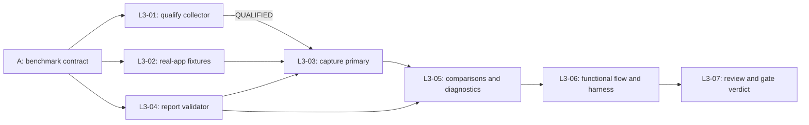

# T06 / #7 — executable L3 breakdown

Status: **Task A measurement-design complete; seven approved execution packets published as sub-issues #34–#40. L3-01 (#34) is closed with an explicit `UNSUPPORTED` collector verdict; the remaining six are not implemented.** Parent [#7](https://github.com/harkon666/Gurow/issues/7) remains the P1 gate. Seven native parent links, seven blocking edges, all issue bodies and `ready-for-agent` labels were read back and verified on 2026-09-28. The parent body and state were not edited.

Primary input-to-visible latency has **no qualified acquisition path**: see [the qualification status record](../../benchmarks/p1/qualification-status.md) and follow-up [#41](https://github.com/harkon666/Gurow/issues/41), which is recorded as a native blocker of L3-03.

Start with [benchmark contract A](../../benchmarks/p1/contract.md), [numeric protocol](../../benchmarks/p1/protocol.json), and [observed reference host](../../benchmarks/p1/reference-environment.json). The contract is fixed enough to implement; presentation collection still requires a real qualification run. A finished design is not evidence of a passing gate.

## Tasks and dependencies

| ID | Independently verifiable outcome | Blocked by | Executor | User stories |
| --- | --- | --- | --- | --- |
| [L3-01](qualify-presentation-collector.md) / [#34](https://github.com/harkon666/Gurow/issues/34) — **CLOSED, `UNSUPPORTED`** | Real-app collector qualification, or explicit unsupported result | A | Strong / measurement specialist | US80, US84 |
| [L3-02](load-deterministic-workloads.md) / [#35](https://github.com/harkon666/Gurow/issues/35) | Prescribed fixtures load through normal app with correct IDs, Tasks, DAG and visible labels | A | Flash candidate | US80, US83, US84 |
| [L3-03](capture-primary-interactions.md) / [#37](https://github.com/harkon666/Gurow/issues/37) | Nine primary windows produce complete input/presentation evidence | L3-01 **QUALIFIED** (not met: #34 is UNSUPPORTED, see [#41](https://github.com/harkon666/Gurow/issues/41)), L3-02, L3-04 | Flash after collector contract | US80, US84 |
| [L3-04](reduce-and-validate-reports.md) / [#36](https://github.com/harkon666/Gurow/issues/36) | Evidence reduces to validated JSON/Markdown verdicts; malformed evidence cannot pass | A | Flash candidate | US84 |
| [L3-05](record-comparisons-and-diagnostics.md) / [#38](https://github.com/harkon666/Gurow/issues/38) | Comparison workloads and resource/boundary diagnostics feed the report | L3-03, L3-04 | Flash candidate | US80, US84 |
| [L3-06](integrate-functional-and-gate-checks.md) / [#39](https://github.com/harkon666/Gurow/issues/39) | Complete P1 flow plus T06 acceptance runs from current-source harness | L3-05 | Flash with independent review | US80, US82, US83, US84 |
| [L3-07](review-evidence-and-decide-p1.md) / [#40](https://github.com/harkon666/Gurow/issues/40) | Independent review and justified parent-gate decision/follow-up | L3-06 | Strong reviewer / integrator | US80, US82, US83, US84 |

L3-01, L3-02 and L3-04 can start independently. L3-04 owns report record types; collector/runner workers coordinate against those types and the frozen contract before integration. No worker concurrently edits another worker's files. L3-03 starts after all three initial handoffs, so its record types and validity rules are already available. Later instrumentation tasks run sequentially because they can touch the same editor/Wasm files.

L3-01 ending UNSUPPORTED is a completed investigation with an unmet execution dependency. Do not treat its CLOSED state alone as enough to start L3-03. Record an optical-acquisition or collector-fix follow-up as a native blocker of L3-03 before closing a published L3-01 with UNSUPPORTED, and keep #7 blocked until qualified evidence exists. The remaining independent fixture/report work may continue.

## Parent acceptance coverage

Original criteria are referenced by their order in #7, not rewritten:

| Parent criterion | Required evidence | Responsible packets |
| --- | --- | --- |
| AC1 — full actual P1 functional path | Browser actions and semantic restored state, dynamic identities, graph rejection, keyboard/list and actual renderer recovery | L3-02, L3-06, L3-07 |
| AC2 — primary workload and ≤20/≤50 ms p95 | Exact fixture, qualified presentation chain, complete per-original-input/continuous-frame records, validated per-run verdicts | L3-01, L3-02, L3-03, L3-04, L3-06, L3-07 |
| AC3 — environment and measurement limitations | Source/build/profile identity, hardware/display/viewport/DPR, input sequence, counts/durations/warm-up and limitations | L3-01, L3-02, L3-03, L3-04, L3-05, L3-07 |
| AC4 — comparisons and diagnostics | 100/10,000-card results, startup/memory/draw/upload/boundary data, unavailable counters explained | L3-02, L3-04, L3-05, L3-06, L3-07 |
| AC5 — failures fixed or surfaced; P2 stays gated | Fail-closed reducer/harness, raw unsuccessful attempts, explicit gaps and bounded follow-up, independent review | L3-01, L3-03, L3-04, L3-05, L3-06, L3-07 |

## Execution contract

Each packet provides outcome, allowed scope, inputs, source pointers, observable criteria, proposed commands, handoff and escalation conditions. Suggested new commands are deliverables, not commands already installed. Paths were checked against source commit `0a3b9be96a8ef89ce74a22d011ce7e9ba49e996d`; workers must refresh stale pointers from live code. They can use Graphify to locate sources without treating graph edges as proof of implementation or acceptance.

Future implementation uses the existing [harness workflow](../../agents/harness.md), one parent T06 session and a fixed implementation base. Current `.harness/` belongs to T05 and is preserved by this design-only change. When implementation starts, archive a different-ticket session as the harness instructs. Do not restart the baseline per subtask or erase prior failure evidence. Full current-source verification remains required for the parent; focused worker checks are intermediate evidence.

Tasks are not split by “Rust versus React versus tests.” Each delivers a complete observable path: fixture→app, input→evidence, evidence→verdict, or commands→full gate. The collector/fixture/reporter seams allow narrow model delegation without giving a worker unresolved architectural authority.

If baseline performance fails, derive further optimization tasks from the measured bottleneck, specifying reproduction and regression proof. Their number and files cannot responsibly be fixed before the baseline. Passing all subtasks cannot imply #7 PASS if a required metric is unmeasured or fails.

## Publication package

The user approved the breakdown on 2026-09-28. Each `*.issue.md` now exactly matches the verified published body; each matching `.md` is its local implementation packet. [manifest.json](manifest.json) records actual issue numbers, dependencies, AC/story mapping and routing. Publication order was L3-01 (#34), L3-02 (#35), L3-04 (#36), L3-03 (#37), L3-05 (#38), L3-06 (#39), L3-07 (#40).

All seven have native parent #7, native blockers matching the graph above, and `ready-for-agent`. This label means the specification is agreed within its stated dependencies; collector qualification and P1 acceptance remain unproven. The original #7 body and state were preserved.

Every issue embeds a self-contained copy of the approved contract, numeric protocol, reference environment and measurement research. Agents can access the normative contract without unpublished repository links. Source pointers and proposed commands remain in the local execution packets. No benchmark has been run as part of publication.
